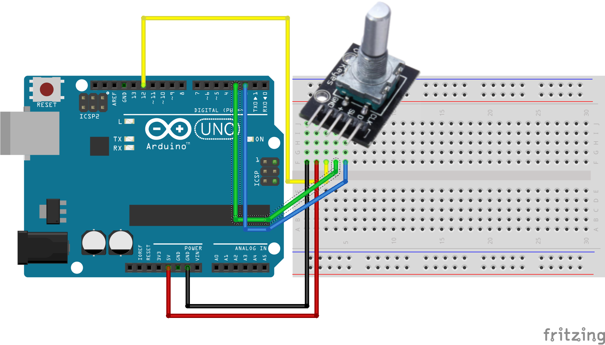

# Rotary encoder
Onderdeel van Bas on Tech Nederlandstalige Arduino lessen - Zie https://arduino-lessen.nl

Abonneer je direct op het Bas on Tech YouTube kanaal via http://www.youtube.com/c/BasOnTechNL?sub_confirmation=1

## De schakeling

## Video
